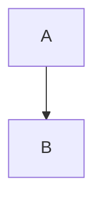

# Как пользоваться
## Со скачиванием

1. Нажмите зеленую кнопку  и выбирите 
2. Откройте архив и перенесите папку `OVR-Program-Main` на рабочий стол
3. Откройте в папке файл `index.html`

## Без скачивания
Откройте **[🔗 этот сайт](https://levonze.github.io/OVR-Program)**

# При возникновении проблем/ошибок/багов/софтлоков

1. Вверху страницы нажмите на 
2. Нажмите зеленую кнопку 
3. Введите заголовок (title) и само описание проблемы (description). Можно добавлять скриншоты (`Win+Left Shift+S` затем `Ctrl+V`)
4. После ввода нажмите на кнопку внизу страницы 

## Статусы проблемы (Issue)

- Проблема открыта и еще не исправлена 
- Проблема исправлена и закрыта 
- Закрыта как дубликат 
  - Это значит такая проблема уже была, нажмите на `#X` чтобы увидеть оригинал дубликата
- Закрыта как не планированная 
  - Патч не будет выпущен так как не удается воспроизвести ошибку

